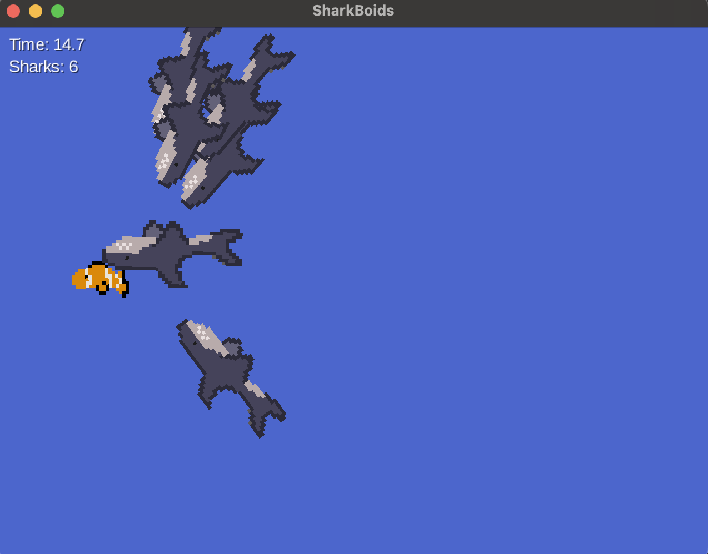
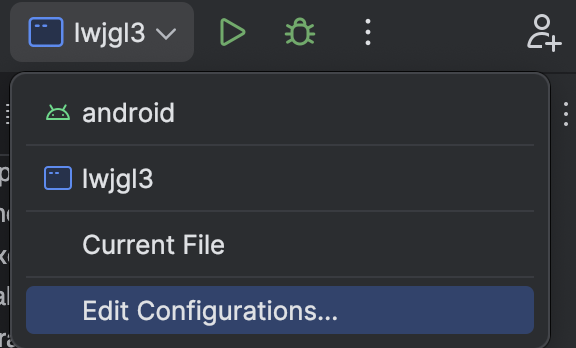
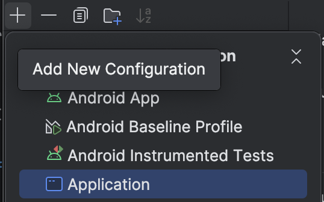
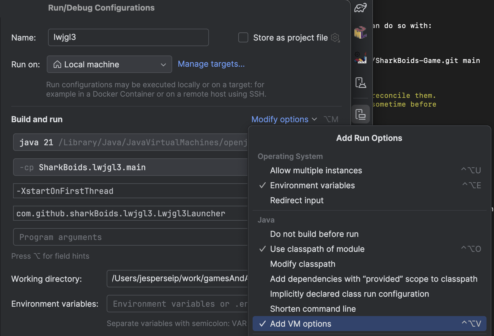
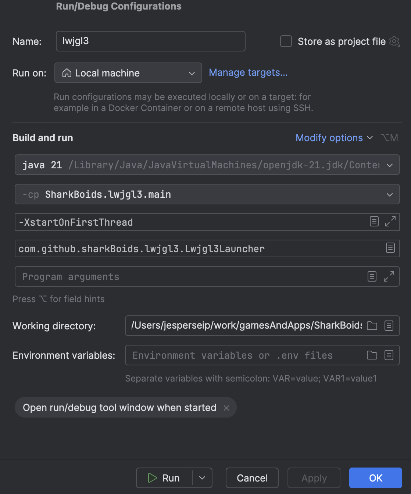

# SharkBoids

A simple Andorid game where the player must escape sharks implemented with the classic [Boids algorithm](https://en.wikipedia.org/wiki/Boids).
The game is an exercise in LibGDX development and specifically in applying the Boids algorithm in a practical application. 



This [libGDX](https://libgdx.com/) project is generated with [gdx-liftoff](https://github.com/libgdx/gdx-liftoff).

## Prerequisites

Before running the project, make sure you have the following installed:

- **Java Development Kit (JDK 17 or higher)** – required to compile and run the game.  
  [Download JDK](https://adoptium.net/)

- **Gradle** – not strictly required, since the project includes the Gradle Wrapper (`./gradlew` / `gradlew.bat`), but installing Gradle globally is recommended.  
  [Download Gradle](https://gradle.org/install/)

- **Android Studio or IntelliJ IDEA** – for easiest setup and to run/debug on desktop or Android.  
  [Download Android Studio](https://developer.android.com/studio)  
  [Download IntelliJ IDEA](https://www.jetbrains.com/idea/)

- **Android SDK** – required if you plan to run the Android version. This can be installed directly via Android Studio.

- **Git LFS** (optional) – if large assets such as images, audio, or video are managed with [Git Large File Storage](https://git-lfs.com/).

---

## Quick Start (Desktop)

If you just want to run the desktop version right away:

# 1. Clone the repository
```bash
git clone https://github.com/Jespardo/SharkBoids-Game.git
```

# 2. Run with Gradle wrapper (Linux/macOS)
```bash
cd SharkBoids-Game
./gradlew :lwjgl3:run
```
# On Windows:
```powershell
cd SharkBoids-Game
gradlew.bat :lwjgl3:run
```

## How to set up wokring enviornment locally:
1.In your IDE (Android Studios or Intellij is the simplest), click `edit configuration`



2.Click the `+`-symbol to add a new configuration and select `Application`.



3. In the new Application config, click `Modify opetions` and select `add VM-options`.



- In this field, enter `-XstartOnFirstThread`

4. For the other fields your configuration should match this:



- Press `ok`.
- Now you can select the lwjgl3 configuration and run the project in you IDE.

**Note:** Alternatively you can run the project with the default Android configuration in Android Studios. However, the controller is not correctly set up for this environment yet, so it is not fully functional.

## Platforms

- `core`: Main module with the application logic shared by all platforms.
- `lwjgl3`: Primary desktop platform using LWJGL3; was called 'desktop' in older docs.
- `android`: Android mobile platform. Needs Android SDK.

## Gradle

This project uses [Gradle](https://gradle.org/) to manage dependencies.
The Gradle wrapper was included, so you can run Gradle tasks using `gradlew.bat` or `./gradlew` commands.
Useful Gradle tasks and flags:

- `--continue`: when using this flag, errors will not stop the tasks from running.
- `--daemon`: thanks to this flag, Gradle daemon will be used to run chosen tasks.
- `--offline`: when using this flag, cached dependency archives will be used.
- `--refresh-dependencies`: this flag forces validation of all dependencies. Useful for snapshot versions.
- `android:lint`: performs Android project validation.
- `build`: builds sources and archives of every project.
- `cleanEclipse`: removes Eclipse project data.
- `cleanIdea`: removes IntelliJ project data.
- `clean`: removes `build` folders, which store compiled classes and built archives.
- `eclipse`: generates Eclipse project data.
- `idea`: generates IntelliJ project data.
- `lwjgl3:jar`: builds application's runnable jar, which can be found at `lwjgl3/build/libs`.
- `lwjgl3:run`: starts the application.
- `test`: runs unit tests (if any).

Note that most tasks that are not specific to a single project can be run with `name:` prefix, where the `name` should be replaced with the ID of a specific project.
For example, `core:clean` removes `build` folder only from the `core` project.
